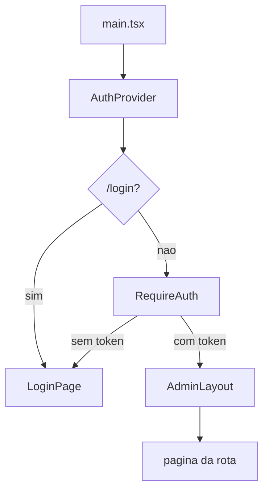

# Arquitetura atual

## Stack

| Peça | Uso |
|---|---|
| React 19 | UI |
| React Router 7 (`BrowserRouter`) | rotas |
| Vite 8 | bundler e proxy de dev |
| TypeScript | tipos locais por página (não há pasta `types/` compartilhada) |

Não há TanStack Query, SWR, form library nem cliente HTTP de terceiros. Cada página faz `fetch` via `apiRequest` dentro de `useEffect`.

## Árvore relevante

```
src/
  main.tsx                 BrowserRouter + App
  App.tsx                  AuthProvider + rotas
  contexts/AuthContext.tsx sessão JWT
  routes/RequireAuth.tsx   guarda de token
  lib/api.ts               client HTTP
  lib/menu.ts              itens da sidebar
  lib/format.ts            data, moeda, JSON
  components/              layout e UI genérica
  pages/                   uma tela por arquivo
```

## Bootstrap

1. `index.html` monta `#root`.
2. `main.tsx` envolve a árvore em `StrictMode` + `BrowserRouter`.
3. `App` envolve tudo em `AuthProvider`.
4. Rotas públicas: `/login` e `*` (404).
5. Demais rotas passam por `ProtectedShell`: `RequireAuth` → `AdminLayout` → `Outlet`.



## Client HTTP (`src/lib/api.ts`)

- Base: `import.meta.env.VITE_ADMIN_API_BASE_URL ?? '/api/v1'`.
- Sempre envia `Content-Type: application/json`.
- Se houver token, envia `Authorization: Bearer <token>`.
- Serializa `body` com `JSON.stringify` quando presente.
- Resposta não-OK: tenta ler `message` do JSON; senão usa `statusText`; senão `'request_failed'`. Lança `Error`.
- Resposta OK: `response.json()` tipado pelo genérico da chamada.
- `buildQueryString` omite `undefined`, `null` e `''`.

Não há retry, timeout, refresh de token nem tratamento de 401 global. Se o JWT expirar no meio da sessão, a página mostra o erro da API; só o bootstrap do `AuthProvider` limpa o token quando `/auth/me` falha.

## Autenticação

Arquivo: `src/contexts/AuthContext.tsx`.

### Persistência

- Chave: `eden-bowls-admin-token` no `localStorage`.
- Estado inicial do token: leitura síncrona dessa chave.

### Tipos de usuário no front

```ts
type AdminRole = 'admin' | 'operator' | 'readonly' | 'customer'

type AdminUser = {
  userId: string
  email: string
  roles: AdminRole[]
  permissions: string[]
}
```

O front espera esse formato em `/auth/me` e, opcionalmente, no retorno de `/auth/login`.

### Login

1. `POST /auth/login` com `{ email, password }`.
2. Espera `{ accessToken: string; user?: AdminUser }`.
3. Grava `accessToken` no `localStorage` e no state.
4. Se `user` vier no payload, usa direto; senão chama `GET /auth/me` com o token novo.

O backend atual expõe `POST /api/v1/auth/token`, não `/auth/login`. O painel ainda chama `/auth/login`.

### Bootstrap da sessão

Quando `token` muda (incluindo o valor lido do `localStorage` no mount):

- Sem token → `isReady = true`, sem usuário.
- Com token → `GET /auth/me`. Sucesso preenche `user`. Falha apaga o token do `localStorage` e do state.

### Logout

Remove a chave do `localStorage`, zera `token` e `user`. **Não** chama `POST /auth/logout`. O `AdminLayout` depois navega para `/login`.

### Guarda de rota

`RequireAuth`:

1. Enquanto `!isReady`, mostra “Carregando sessão...”.
2. Sem token, redireciona para `/login` com `state.from = location.pathname`.
3. Com token, renderiza os filhos.

Não valida papéis nem `permissions`. Um JWT qualquer que passe em `/auth/me` (ou que exista no `localStorage` até o bootstrap falhar) entra no shell.

### Tela de login

- Se já existe token, redireciona para `state.from` ou `/dashboard`.
- Submit chama `login(email, password)` e depois `navigate(from, { replace: true })`.
- Copy da tela pede perfil `admin`, `operator` ou `readonly`. Isso **não é validado no cliente**.

## Rotas (`src/App.tsx`)

| Path | Componente | Auth |
|---|---|---|
| `/login` | `LoginPage` | pública; redireciona se já autenticado |
| `/` | `Navigate` → `/dashboard` | protegida |
| `/dashboard` | `DashboardPage` | protegida |
| `/catalog/products` | `ProductsPage` | protegida |
| `/catalog/pricing` | `PricingPage` | protegida |
| `/onboarding/sessions` | `OnboardingPage` | protegida |
| `/onboarding/sessions/:id` | `OnboardingSessionPage` | protegida |
| `/billing` | `BillingPage` | protegida |
| `/config/business-rules` | `BusinessRulesPage` | protegida |
| `/users` | `UsersPage` | protegida |
| `/orders` | `OrdersPage` | protegida |
| `/orders/:orderId` | `OrderDetailPage` | protegida |
| `*` | `NotFoundPage` | pública (fora do layout) |

404 não usa `AdminLayout`. O botão volta para `/dashboard` (que cai em `RequireAuth` se não houver sessão).

## Menu e papéis (`src/lib/menu.ts` + `AdminLayout`)

A sidebar filtra `adminMenu` assim:

- Item **sem** `roles` → sempre visível (Dashboard, Onboarding).
- Item **com** `roles` → visível se `user.roles` intersecta a lista.
- Sem `user` (token ainda sem `/auth/me`) → itens com `roles` somem.

| Item | href | `roles` no menu |
|---|---|---|
| Dashboard | `/dashboard` | (todos autenticados) |
| Onboarding | `/onboarding/sessions` | (todos autenticados) |
| Produtos | `/catalog/products` | admin, operator, readonly |
| Preços | `/catalog/pricing` | admin, operator, readonly |
| Billing | `/billing` | admin, operator, readonly |
| Regras de negócio | `/config/business-rules` | admin, operator, readonly |
| Usuários | `/users` | admin, operator, readonly |
| Pedidos | `/orders` | **admin, operator** (readonly não vê o item) |

`readonly` não vê Pedidos no menu, mas `/orders` e `/orders/:orderId` continuam acessíveis pela URL. Billing e regras também ficam visíveis para `readonly`, inclusive os formulários de sync e edição.

O topbar mostra `user.email` e `user.roles.join(' · ')`.

## Layout e componentes genéricos

| Componente | Função |
|---|---|
| `AdminLayout` | sidebar + topbar + área de conteúdo |
| `PageFrame` | título/descrição da página (eyebrow fixo “Blueprint”) |
| `Section` | card de seção |
| `MetricCard` | KPI (`label`, `value`, `hint`) |
| `FiltersBar` | agrupador de filtros |
| `Pager` | Anterior / Próxima; desabilita nas pontas |

Padrão de listagem nas telas:

1. Estado local de filtros + `page` + `perPage`.
2. `useEffect` recarrega quando token ou filtros mudam.
3. Alterar filtro zera a página para `1`.
4. Erro vira `div.alert` com `error.message`.

## Formatação (`src/lib/format.ts`)

- `formatDate`: `pt-BR`, `dateStyle: medium` + `timeStyle: short`. Valor vazio ou inválido → `-`.
- `formatCurrency`: `Intl.NumberFormat` `pt-BR` com a moeda informada (default `BRL`).
- `formatJson`: `JSON.stringify(value, null, 2)`.

## Dev server (`vite.config.ts`)

```ts
server: {
  host: '0.0.0.0',
  port: 5174,
  proxy: { '/api': { target: 'http://127.0.0.1:3000', changeOrigin: true } }
}
```

Com a base default `/api/v1`, as chamadas do browser vão para o Vite e o proxy encaminha ao backend na porta 3000.
